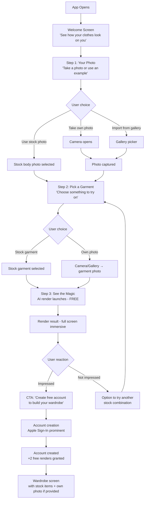
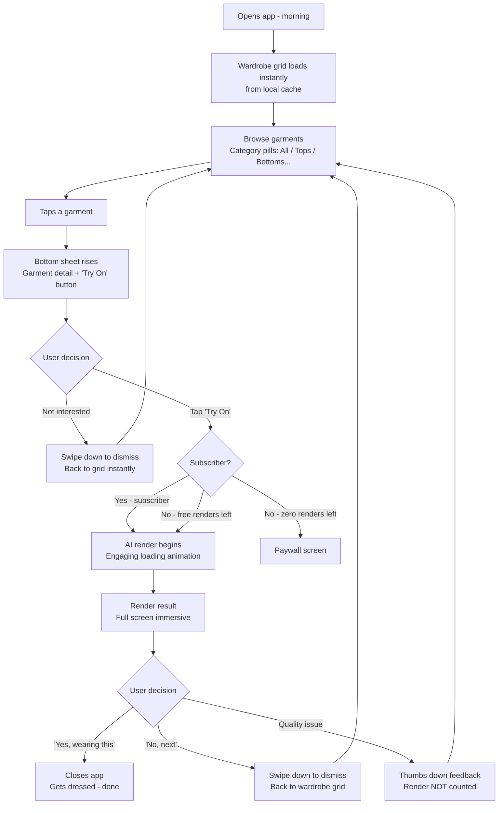
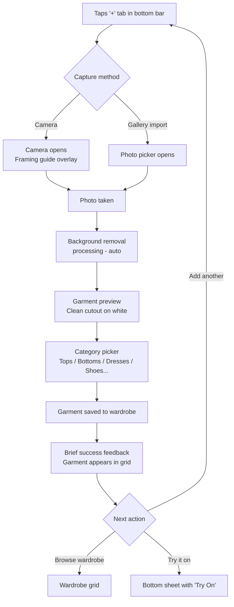
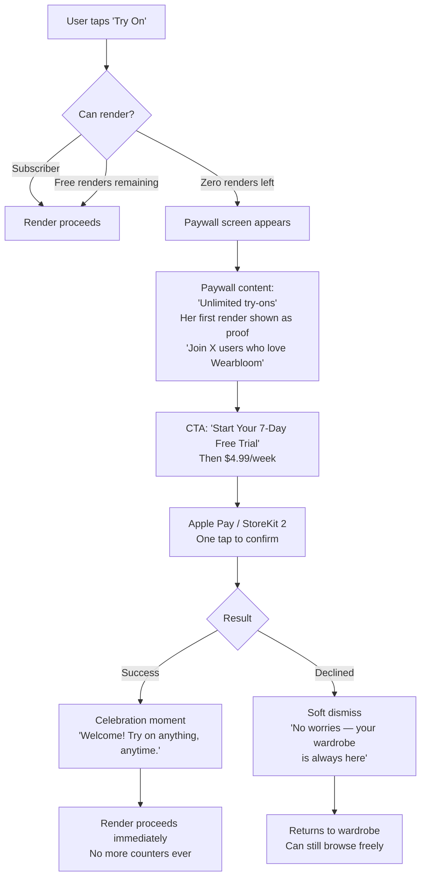

# UX Design Specification — Wearbloom

**Author:** Axel
**Date:** 2026-02-09

---

## Executive Summary

### Project Vision

Wearbloom is an AI-powered iOS mobile app that reverses the virtual try-on paradigm: instead of trying on new clothes before purchase, users try on what they already own to decide what to wear. The app targets the daily "what do I wear?" decision, transforming it from a frustrating guessing game into a confident visual choice. Positioned as anti-fast-fashion — "use better what you already have."

### Target Users

Fashion-conscious women aged 18-35 with high mobile fluency (native TikTok/Instagram users). Comfortable with visual, gesture-driven interfaces. Primary persona: Estelle, 22, who faces daily wardrobe paralysis — she has clothes she likes but can't visualize combinations without trying them on physically.

**Key usage moments:**
- Morning routine — deciding what to wear before getting dressed
- Pre-event preparation — choosing an outfit before a night out

**Tech comfort:** High. Expects instant, polished mobile experiences. Zero tolerance for clunky flows or slow interfaces.

### Key Design Challenges

1. **Minimal friction is non-negotiable** — Users are time-pressured (morning rush) or excitement-driven (pre-event). Every unnecessary tap risks abandonment. Try-on must be reachable in 2 taps or fewer from the home screen.

2. **AI render wait time (5-10 seconds)** — Must be transformed from frustrating dead time into an acceptable or even engaging moment through thoughtful loading UX (animations, transitions, progressive reveal).

3. **Onboarding must deliver instant wow** — The first try-on with stock photos must be impressive within 60 seconds of download. A disappointing first render means permanent churn.

4. **Wardrobe building without tedium** — Photographing garments one by one is inherently tedious. The UX must make adding garments quick and keep it optional early on (stock garments bridge the gap).

### Design Opportunities

1. **"Swipe to try" browsing pattern** — Leverage familiar gesture patterns from TikTok for ultra-fast wardrobe browsing. Scroll through garments, tap to try on.

2. **The "oh yes, that's it!" moment** — The emotional peak when a render solves the morning dilemma. The UI should amplify this moment — clean, focused, not buried in a cluttered interface.

3. **Anti-fast-fashion as visual identity** — Opportunity to stand out from traditional fashion apps with an authentic, natural aesthetic. The brand identity itself becomes a differentiator.

## Core User Experience

### Defining Experience

The core experience of Wearbloom operates on two complementary loops:

**Primary loop — Try-on decision:**
Browse wardrobe → select garment → see AI render on your body → decide ("yes, wearing this" or "next").

**Secondary loop — Wardrobe browsing:**
Scroll through your garment collection, visually organize what you own. This loop has standalone value — users may spend significant time browsing without triggering a render. The wardrobe must feel like a beautiful, personal space worth opening on its own.

**The core action to nail:** The transition from "I don't know what to wear" to "yes, that's the one." Everything in the app exists to serve this moment.

### Platform Strategy

- **iOS-first** mobile app (React Native / Expo)
- **Touch-native interface** — swipe, tap, scroll. No complex menus or settings buried in layers
- **Offline browsing** of wardrobe and previous renders. Online required only for AI try-on generation
- **Camera integration** for garment photography and body photo capture

### Competitive Landscape & Design Influences

Analysis of leading wardrobe apps (Acloset 4M+ users, Whering 9M+ users, Cladwell) reveals proven patterns and clear pitfalls:

**Proven patterns to adopt:**

| Pattern | Source | Wearbloom Application |
|---------|--------|---------------------|
| Visual grid with removed backgrounds | All three apps | Wardrobe view = clean grid, cutout photos on neutral background |
| Horizontal category filter buttons | Whering, Acloset | Scrollable category pills at top (Tops, Bottoms, Shoes...) |
| Automatic background removal on upload | All three apps | Applied at garment photo capture (if technically viable) |
| Transparent AI processing indicators | Acloset | During AI render: animation + clear progress feedback |
| Category-based default organization | Anti-pattern from Whering | Organize by category, never chronologically |

**Anti-patterns to avoid:**

| Pitfall | Source | Wearbloom Approach |
|---------|--------|-------------------|
| Feature bloat (marketplace + social + closet) | Acloset | Stay laser-focused: personal wardrobe + AI try-on only |
| Unreliable core features (crashes, lag, data loss) | All three apps | Reliability as competitive advantage — the bar is low |
| Rigid outfit structure (max 4 items, no accessories) | Cladwell | Not applicable at MVP (single garment try-on) |
| Chronological default sort | Whering | Always organize wardrobe by category |
| Poor AI suggestion context (cardigans at 35°C) | Cladwell | User-driven selection eliminates this problem entirely |

**Key competitive insight:** All three apps suffer from significant bugs, crashes, and performance issues. Users explicitly complain about unreliability. A stable, fast, focused app is a genuine differentiator in this space.

### Effortless Interactions

- **Wardrobe browsing** should feel like scrolling Instagram — visual-first grid of cutout garment photos on clean background, fast, no loading spinners for cached content
- **Try-on trigger** should be a single tap from the wardrobe view — no intermediate screens, no configuration
- **Garment addition** should be: take photo → automatic background removal → pick category manually → done. Three steps, under 10 seconds
- **Category selection** is manual at MVP — simple picker, not an obstacle. Auto-categorization can come later
- **Returning to wardrobe** after a render should be instant — no "back-back-back" navigation

### Critical Success Moments

1. **The morning resolution** (make-or-break moment) — User opens the app unsure what to wear, tries 1-3 garments, finds the one. This is the moment that creates a daily habit. If it doesn't happen, nothing else matters.

2. **First try-on during onboarding** — Must deliver an impressive result within 60 seconds using stock photos. This creates the initial hook, but it's not sufficient alone — the user must later experience moment #1 with her own clothes.

3. **Wardrobe reaching critical mass** — When the user has enough garments photographed that browsing feels like opening a real closet. This is the lock-in moment — the app becomes indispensable.

### Experience Principles

1. **Solve the dilemma, don't showcase tech** — The AI render is a means, not the end. Success is measured by "did she decide what to wear?", not "was the render photorealistic?"

2. **The wardrobe is a destination** — Browsing your clothes should feel valuable even without AI renders. A beautiful, personal collection worth opening daily. Competitor analysis confirms: users spend significant time just browsing.

3. **Zero-thought interactions** — Every core action (browse, try-on, add garment) should require no learning, no instructions, no hesitation. If you have to think about how to do it, the UX failed.

4. **Borrow what works, stay focused** — Adopt proven wardrobe grid and category patterns from competitors. Innovate only where Wearbloom is truly different: the AI try-on experience. Resist the temptation to add social features, marketplace, or anything that dilutes the core purpose.

5. **Reliability is a feature** — Competitors all suffer from crashes, lag, and data loss. A stable, fast app that simply works is a genuine competitive advantage in this category.

## Desired Emotional Response

### Primary Emotional Goals

**Core emotion: The pleasure of browsing — at home, in 30 seconds.**
The same light, enjoyable feeling of wandering through a store and spotting something that clicks. Not a chore, not a task — a moment of personal pleasure. The app should feel like a treat, not a tool.

**Resolution emotion: Quiet excitement.**
When the user finds the garment — a small rush of "yes, that's what I'm wearing today." Confidence mixed with anticipation. She closes the app already looking forward to putting it on.

### Emotional Journey Map

| Moment | Desired Emotion | Risk Emotion | Design Response |
|--------|----------------|--------------|-----------------|
| Opening the app (morning) | Anticipation, light curiosity — "let's see what I'll wear" | Dread — "ugh, another thing to do" | Instant wardrobe view, no splash screens or loading. The app opens ready |
| Browsing the wardrobe | Pleasure of browsing, rediscovery — "oh I forgot about this one" | Boredom — scrolling through a lifeless grid | Beautiful garment photos, smooth scrolling, visual delight in the collection itself |
| Tapping a garment to try on | Playful curiosity — "let's see how this looks" | Impatience — waiting for the render | Immediate visual feedback (transition animation) before render completes |
| Seeing the AI render | Excitement or clarity — "yes!" or "no, next" | Doubt — "this doesn't look like me" | Clean, focused render view. No distractions. Let the image speak |
| Finding the right garment | Quiet confidence — "I know what I'm wearing" | Indifference — "meh, whatever" | Subtle positive reinforcement. The moment should feel like a small win |
| Closing the app | Satisfaction — resolved, ready to get dressed | Guilt — "I wasted time" | The interaction should be brief enough that it never feels like wasted time |

### Micro-Emotions

**To cultivate:**
- **Curiosity** during browse — "what if I tried this one?" Each garment is a possibility
- **Rediscovery** — "oh I haven't worn this in ages!" The wardrobe surfaces forgotten pieces
- **Playfulness** — trying garments should feel like play, not a decision matrix
- **Self-confidence** — the render confirms "this works on me"

**To prevent (priority order):**
1. **Boredom** (enemy #1) — if the app feels tedious, users won't open it tomorrow. Every interaction must feel alive and engaging
2. **Frustration** — slow renders, crashes, confusing navigation. Technical failures kill the emotional experience
3. **Self-doubt** — a bad render could make users feel worse about themselves. The experience must be empowering, never discouraging
4. **Obligation** — the app must never feel like homework. No guilt mechanics, no "you haven't logged your outfit" nudges

### Design Implications

| Emotion to Create | UX Design Approach |
|---|---|
| Browsing pleasure | Visual-first wardrobe grid with beautiful cutout photos. Smooth, fluid scrolling. The wardrobe itself should be aesthetically pleasing to look at |
| Playful curiosity | Single-tap try-on with no confirmation dialogs. Make it effortless to try "just one more" |
| Rediscovery | Wardrobe organization that naturally surfaces variety — not just recently added items |
| Quiet confidence | Clean render display — full screen, no clutter, let the user focus on "does this work?" |
| Anti-boredom | Fast transitions, responsive touch, no dead states. If the AI is rendering, the wait must be visually engaging, never a blank screen |
| Anti-frustration | Graceful error handling. If a render fails, don't consume a credit and offer a clear path forward |

### Emotional Design Principles

1. **Pleasure over productivity** — This is not a task management app. The emotional benchmark is "flâner dans les magasins" — leisurely, enjoyable, personal. If any interaction feels like work, it's wrong.

2. **Boredom is the real enemy** — Not bugs, not slow AI. Boredom. The app must feel alive at every touch point — responsive animations, beautiful imagery, a sense of possibility when scrolling.

3. **Confidence, not perfection** — The render doesn't need to be photorealistic. It needs to answer one question: "does this work on me?" If the user walks away feeling good about her choice, the emotional goal is met.

4. **Never make her feel bad** — No guilt about unused clothes, no pressure to log outfits, no judgment. The app is a supportive companion, not a critical mirror.

## UX Pattern Analysis & Inspiration

### Inspiring Products Analysis

#### Pinterest — The Visual Browse Benchmark

Pinterest is the closest emotional analogy to what Wearbloom should feel like. Both apps serve the same core need: browsing visual options to make a decision. Pinterest helps users decide what to cook, how to decorate, what to wear. Wearbloom helps decide what to wear today — from your own closet.

**What Pinterest nails:**

1. **Visual-first, text-last** — Images dominate the interface. Labels, descriptions, metadata are secondary or hidden until tapped. The eye does the work, not the brain. For Wearbloom: garment photos should fill the screen. No labels, no metadata visible in browse mode.

2. **The masonry grid** — Pinterest's staggered grid (varying image heights) creates visual rhythm and prevents the "spreadsheet" feeling. Each scroll reveals new compositions. For Wearbloom: a uniform grid is more appropriate (garment photos are similar aspect ratios), but the lesson is clear — the grid itself must be visually engaging, not a flat catalog.

3. **Zero-commitment exploration** — Tapping an image in Pinterest is never a commitment. You can always go back instantly. There's no "are you sure?" friction. For Wearbloom: tapping a garment to try on should feel equally casual — "let's see" not "I'm deciding."

4. **The endless possibility feeling** — Pinterest makes you feel like there's always one more great thing to discover. The scroll never feels like it's ending. For Wearbloom: even a modest wardrobe of 20 items should feel full of possibilities, not like a short list.

5. **Instant save, no friction** — One tap to save to a board. No forms, no dialogs. For Wearbloom: adding a garment should feel similarly effortless — photo, category, done.

#### Wardrobe App Competitors — Proven Patterns (from prior analysis)

**Acloset (4M+ users):** Grid view with background removal, AI processing indicators, category-based collections. Lesson: background removal creates a cohesive, clean look that users love.

**Whering (9M+ users):** Multiple outfit creation modes (shuffle, canvas, AI suggestions), weather integration. Lesson: different browse modes serve different moods — sometimes you want to explore, sometimes you want a quick answer.

**Cladwell:** Template-first onboarding for fast setup, strong analytics dashboard. Lesson: reducing initial setup friction is critical — stock garments for Wearbloom serve the same purpose as Cladwell's templates.

**Common failure across all three:** Bugs, lag, crashes. Users explicitly cite reliability as a top complaint. The bar for "just works" is surprisingly low in this category.

### Transferable UX Patterns

**Navigation Patterns:**

| Pattern | Source | Wearbloom Application |
|---------|--------|---------------------|
| Bottom tab bar (3-4 tabs max) | All wardrobe apps, Instagram | Minimal tabs: Wardrobe, Try-On result, Profile/Settings |
| Category filter pills (horizontal scroll) | Whering, Acloset | Top of wardrobe: scrollable category buttons (All, Tops, Bottoms, Dresses, Shoes...) |
| Full-screen detail view on tap | Pinterest, Instagram | Garment detail → try-on render in full-screen focused view |
| Swipe back to return | iOS native, Pinterest | Always one swipe to go back to wardrobe — no navigation traps |

**Interaction Patterns:**

| Pattern | Source | Wearbloom Application |
|---------|--------|---------------------|
| Single-tap primary action | Pinterest (save), Tinder (swipe) | Single tap on garment = launch AI try-on |
| Pull-to-refresh | Universal mobile | Refresh wardrobe or trigger new render |
| Smooth scroll with momentum | Pinterest, TikTok | Wardrobe browsing must feel buttery smooth — 60fps, no jank |
| Progressive loading | Pinterest (blur → sharp) | During AI render: show blurred preview → reveal sharp result |

**Visual Patterns:**

| Pattern | Source | Wearbloom Application |
|---------|--------|---------------------|
| Clean grid with removed backgrounds | Wardrobe apps | Garments displayed as cutouts on neutral/soft background |
| Visual-first, minimal text | Pinterest | No garment names or labels in grid view — the photo IS the information |
| Generous whitespace | Pinterest | Let garment photos breathe — don't pack the grid too tight |
| Soft, warm color palette | Anti-pattern from Whering's neon | Align with anti-fast-fashion identity: natural tones, not flashy |

### Anti-Patterns to Avoid

| Anti-Pattern | Source | Why It Fails | Wearbloom Approach |
|---|---|---|---|
| Feature bloat (social + marketplace + closet) | Acloset | Clutters the interface, dilutes focus | Single purpose: wardrobe + try-on. Nothing else |
| Chronological default sort | Whering | Users can't find anything, wardrobe feels disorganized | Always category-based organization |
| Aggressive onboarding forms | Cladwell templates | Users want to see value fast, not fill out profiles | 3-step flow with stock photos — value in 60 seconds |
| Confirmation dialogs before actions | Generic mobile anti-pattern | Kills the casual "let me try" energy | No "are you sure?" before try-on. Just do it |
| Blank loading screens | Generic | Boredom is enemy #1 — dead screens kill engagement | Always show something: animation, preview, progress |
| Guilt-based engagement (streaks, nudges) | Cladwell streaks, fitness apps | Conflicts with "pleasure over productivity" principle | No streaks, no "you haven't opened the app" notifications |

### Design Inspiration Strategy

**Adopt directly:**
- Pinterest's visual-first philosophy — images dominate, text is secondary
- Pinterest's zero-commitment tap — exploring never feels like deciding
- Wardrobe apps' background removal — creates cohesive, clean garment grid
- Wardrobe apps' category filter pills — proven, familiar, efficient

**Adapt for Wearbloom:**
- Pinterest's masonry grid → uniform grid (garments have consistent aspect ratios) but keep the visual rhythm
- Pinterest's infinite scroll → finite wardrobe but should feel full of possibilities
- Wardrobe apps' shuffle/suggestion modes → simplified to single-tap try-on at MVP

**Reject entirely:**
- Social features, feeds, community — not at MVP, possibly never
- Marketplace integration — conflicts with anti-fast-fashion identity
- Complex outfit composition — single garment try-on only at MVP
- Gamification mechanics (streaks, missions, levels) — conflicts with "pleasure, not productivity"

## Design System Foundation

### Design System Choice

**NativeWind v4 (Tailwind CSS for React Native) + Gluestack UI v3** as the styling and component foundation.

This is a utility-first approach: Tailwind classes for all styling (`className="bg-white rounded-xl p-4"`), with Gluestack providing accessible, unstyled components that integrate with NativeWind. No imposed visual identity — full creative control over the look and feel.

### Rationale for Selection

1. **Community standard (2025-2026)** — NativeWind leads with 403k weekly downloads. The React Native ecosystem is in a "Tailwind race" with Expo signaling first-party CSS/Tailwind support. This is the modern choice.

2. **Visual uniqueness** — Unlike React Native Paper (Material Design look) or opinionated component libraries, NativeWind imposes no visual identity. Wearbloom can have a distinctive anti-fast-fashion aesthetic without fighting the framework.

3. **Solo developer productivity** — Tailwind's utility classes are fast to write, easy to read, and eliminate the need to name and organize stylesheets. AI coding assistants are highly fluent in Tailwind syntax.

4. **Performance** — NativeWind compiles Tailwind classes at build time (zero runtime cost). Combined with Expo's New Architecture (enabled by default since SDK 52+), this delivers native performance.

### Supporting Library Stack

| Category | Library | Role |
|----------|---------|------|
| Navigation | Expo Router | File-based routing, recommended by React Native docs for new projects |
| Animations | React Native Reanimated v4 + Moti | 60fps UI-thread animations. Moti provides simplified Framer Motion-like API |
| Images | expo-image | Official Expo image solution with built-in caching and lazy loading |
| Grid/Lists | FlashList v2 | Pinterest-style masonry layout with cell recycling. Critical for wardrobe grid performance |
| Gestures | react-native-gesture-handler v2 | Swipe, drag, tap gesture support |

### Customization Strategy

The design system will be customized through:

- **Tailwind theme configuration** — Custom color palette (warm, natural tones for anti-fast-fashion identity), spacing scale, border radius tokens, typography scale
- **Gluestack component overrides** — Unstyled base components themed with NativeWind classes to match Wearbloom's visual identity
- **Reanimated/Moti presets** — Consistent animation curves and durations across the app (transitions, loading states, micro-interactions)
- **No pre-built theme adoption** — Every visual decision is intentional, aligned with the emotional design principles established earlier

## Defining User Experience

### Defining Experience

**"Tap a garment, see it on you."**

Wearbloom's defining experience is the transformation from "looking at a flat garment photo" to "seeing it on my body." This is what users will describe to friends, what makes Wearbloom different from every wardrobe app, and what justifies the subscription.

The core interaction in one sentence: Browse your wardrobe → tap a garment to preview it → tap "Try on" to see the AI render on your body → decide.

### User Mental Model

**Current behavior (without Wearbloom):**
Estelle stands in front of her open closet. She pulls garments out, holds them against her body in the mirror, sometimes tries them on physically, takes them off, tries another. It's slow, messy, and she often gives up and falls back on a "safe" combination.

**Wearbloom replaces this with:**
The same mental process — browsing, considering, trying — but digitally, instantly, without getting undressed. The mental model stays the same ("I'm looking through my clothes to find what works"), but the execution becomes effortless.

**Key insight:** Users don't need to learn a new mental model. They already know how to browse and choose clothes. Wearbloom just removes the physical friction. The UX should feel like a natural extension of "looking through my closet" — not a new app to learn.

### Success Criteria

| Criteria | Target | Why It Matters |
|----------|--------|----------------|
| Taps from app open to render result | 3 (browse → tap garment → tap "Try on") | More than 3 and it feels slower than the physical closet |
| Time from "Try on" tap to render visible | 5-10 seconds (AI constraint) | Must feel acceptable, not painful |
| Time to return to wardrobe after render | Instant (< 300ms) | "No, next" must be frictionless — she wants to try another one |
| Garments tried per session | 1-5 typical | The flow must support rapid sequential try-ons without fatigue |
| Credit consumed accidentally | Never | Misclicks must not trigger renders — garment preview screen prevents this |

### Novel UX Patterns

**Mostly established patterns, one novel layer:**

The wardrobe browsing, grid view, category filters, and garment detail screens all use established mobile patterns that users already understand. No education needed.

**The novel element is the AI try-on render itself.** Users have never seen their own clothes rendered on their body by AI in a personal wardrobe context. This is new — but the interaction pattern around it is familiar (tap to see a result, like applying a filter in Instagram).

**Design approach:** Wrap the novel AI experience in entirely familiar interaction patterns. The magic should be in the result, not in learning how to use the app.

### Experience Mechanics

**1. Initiation — Opening the app**
- App opens directly to wardrobe grid (last used category remembered)
- No splash screen, no "what's new" modal, no loading gate
- Wardrobe loads from local cache instantly — even offline

**2. Browsing — Finding a garment to try**
- Visual grid of garment cutout photos (FlashList masonry)
- Category filter pills at top (All, Tops, Bottoms, Dresses, Shoes...)
- Smooth scrolling, cached thumbnails, no loading spinners
- This phase can last seconds or minutes — it's pleasurable, not a means to an end

**3. Selection — Tapping a garment**
- Tap on garment → garment detail view (full-screen or large preview of the garment photo)
- Shows the garment clearly — this is the "do I want to try this?" moment
- Prominent "Try on" button to launch AI render
- Back swipe or tap to return to grid (no credit consumed, no commitment)
- This intermediate screen prevents accidental renders and wasted credits

**4. Rendering — The AI try-on**
- "Try on" tap → AI render begins (5-10 seconds)
- Engaging loading state: animation or progressive reveal (blurred → sharp)
- Never a blank screen or static spinner
- Credit consumed only when render succeeds — failed renders don't cost

**5. Result — Seeing the render**
- Full-screen render of the garment on the user's body
- Clean, focused view — no clutter, no overlapping UI
- Two clear paths forward:
  - **"Try another"** → returns to wardrobe grid instantly
  - **Close the app** → she found her outfit, she's done
- Optional: quality feedback button (quick thumbs up/down for render quality)

**6. Completion — The morning is solved**
- No forced "save outfit" step, no "mark as worn today" prompt
- The app served its purpose. She closes it and gets dressed
- The value was delivered the moment she decided what to wear

## Visual Design Foundation

### Color System

**Philosophy:** Premium neutral frame. The app feels like a high-end dressing room — clean, bright, luxurious. Garment photos are the only color that matters. The UI disappears behind the content.

**Base palette:**

| Token | Color | Hex | Usage |
|-------|-------|-----|-------|
| `background` | Pure white | `#FFFFFF` | App background — clean, bright, premium |
| `surface` | Cool off-white | `#F7F7F7` | Cards, secondary backgrounds, input fields |
| `surface-elevated` | White | `#FFFFFF` | Bottom sheets, modals, overlays (with shadow for elevation) |
| `text-primary` | Near black | `#1A1A1A` | Primary text — crisp, luxe, high contrast |
| `text-secondary` | Medium gray | `#6B6B6B` | Secondary text, labels, timestamps |
| `text-tertiary` | Light gray | `#A3A3A3` | Placeholder text, disabled states |
| `border` | Subtle gray | `#EBEBEB` | Dividers, card borders — barely visible |
| `accent` | Soft black | `#1A1A1A` | Primary buttons ("Try on"), key CTAs — black = luxury |
| `accent-highlight` | Nude blush | `#E8C4B8` | Selected states, active category pill, subtle highlights |
| `accent-highlight-soft` | Light blush | `#F5EBE7` | Accent backgrounds, selected card borders |
| `success` | Soft green | `#4CAF82` | Success states |
| `warning` | Warm gold | `#E5A940` | Credit low indicator |
| `error` | Soft red | `#D45555` | Error states, failed renders |

**Rationale:**
- **Black primary buttons** — the luxury signal. Chanel, YSL, Zara, COS — premium fashion brands use black as their action color. It says "quality" without trying
- **Nude blush as highlight** — feminine, warm, premium. Not "pink" (childish), not "terracotta" (niche). The sweet spot between Glossier and high fashion. Used sparingly for selected states, not dominant
- **White + black base** — maximum contrast, maximum premium feel, maximum focus on garment photos. The clothes pop against a clean white canvas
- **No dominant brand color** — the app doesn't fight with garment colors. The user's wardrobe IS the color palette

**Why this converts better:**
- Black CTAs have higher conversion rates than colored buttons in fashion contexts — they feel decisive and premium
- White backgrounds make product images look their best (every luxury e-commerce uses this)
- The palette says "4.99€/week is a good deal" — it feels worth paying for

### Typography System

**Strategy:** Serif headlines for editorial fashion credibility + clean sans-serif for UI readability. The mix signals "fashion app" not "utility app."

**Typefaces:**

| Role | Font | Why |
|------|------|-----|
| Brand / Headlines | **DM Serif Display** | Elegant, modern serif. Fashion-magazine feel without being old-fashioned. Free, excellent on mobile |
| Body / UI | **Inter** (falls back to SF Pro on iOS) | Industry standard for mobile UI. Crisp at all sizes, excellent readability |

**Type scale:**

| Token | Size | Weight | Font | Usage |
|-------|------|--------|------|-------|
| `display` | 28px | DM Serif, Regular | Serif | Screen titles ("My Wardrobe", "Try On") |
| `heading` | 22px | DM Serif, Regular | Serif | Section headers |
| `title` | 17px | Inter, Semibold | Sans | Card titles, navigation items |
| `body` | 15px | Inter, Regular | Sans | Body text, descriptions |
| `caption` | 13px | Inter, Medium | Sans | Labels, category pills, secondary info |
| `small` | 11px | Inter, Semibold | Sans | Badges, credit count, metadata |

**Key choices:**
- Serif only for display/heading — never for body text (readability)
- Body at 15px not 16px — slightly tighter, feels more refined/fashion (still readable)
- Semibold for `small` — ensures legibility at small sizes

### Spacing & Layout Foundation

**Base unit:** 4px grid. All spacing is a multiple of 4.

| Token | Value | Usage |
|-------|-------|-------|
| `xs` | 4px | Minimal gaps (icon to label) |
| `sm` | 8px | Tight spacing (within cards, pill padding) |
| `md` | 16px | Standard spacing (card padding, between elements) |
| `lg` | 24px | Section spacing |
| `xl` | 32px | Major section breaks |
| `2xl` | 48px | Screen-level top/bottom margins |

**Wardrobe grid layout:**
- **2 columns** on standard phones, **3 columns** on larger devices
- **8px gutter** between items — tight enough to feel full, open enough to breathe
- **1:1.2 aspect ratio** for garment cards (slightly taller than square — flattering for clothing photos)
- Garment photos fill the card edge-to-edge — no internal padding on images
- Rounded corners: 12px on cards — modern, soft, not aggressive

**Screen layout principles:**
- **Content starts immediately** — no hero banners, no decorative headers eating screen space
- **Bottom tab bar** — 3 tabs: Wardrobe (home), Add (+), Profile
- **Category pills** — fixed below status bar, horizontally scrollable, always accessible during browse
- **Full-bleed renders** — AI try-on results use the entire screen. No chrome, no distractions
- **Floating action elements** — "Try on" button floats over garment detail, always visible

**Elevation system:**
- Level 0: Flat (wardrobe grid items)
- Level 1: Subtle shadow (cards, bottom bar) — `shadow-sm` in Tailwind
- Level 2: Medium shadow (bottom sheet, modals) — `shadow-md`
- No heavy shadows — keeps the feel light and clean

### Accessibility Considerations

- **Color contrast:** `#1A1A1A` on `#FFFFFF` = 17.4:1 ratio (exceeds WCAG AAA). `#6B6B6B` on `#FFFFFF` = 5.7:1 (exceeds WCAG AA)
- **Touch targets:** Minimum 44x44px for all tappable elements (Apple HIG)
- **Color not sole indicator:** Selected states use both color change AND shape/weight change (filled icon, bold text, border)
- **Dynamic Type:** Supports iOS text size preferences
- **Reduce Motion:** Respects iOS accessibility setting — simplifies animations to simple fades
- **VoiceOver:** All interactive elements labeled. Garment images include category as alt text ("Blue dress, Dresses category")

## Design Direction Decision

### Design Directions Explored

Four visual directions were generated and evaluated as interactive HTML mockups (`ux-design-directions.html`), each showing three core screens (Wardrobe Grid, Garment Detail, Render Result):

1. **Editorial Clean** — Maximum whitespace, 2-column large cards, magazine-editorial feel. Glossier meets Vogue.
2. **Compact Browse** — Dense 3-column grid, bottom sheet detail pattern, efficient layout. Pinterest meets luxury fashion.
3. **Immersive Visual** — Edge-to-edge imagery, minimal chrome, zero borders, full-screen renders. Instagram Stories meets fashion catalog.
4. **Card-Based Refined** — Elevated cards with shadows, structured visual hierarchy, contained render. Apple design meets fashion.

### Chosen Direction

**Direction 3: Immersive Visual** — as primary foundation, with two targeted borrowings:

**From Direction 1/2: Always-visible category pills**
The pure Immersive direction hides category filters until scroll-up. This is visually clean but hurts usability. Category pills remain fixed below the status bar at all times during wardrobe browsing — proven, familiar, and essential for quick filtering.

**From Direction 2: Bottom sheet for garment detail**
Instead of a full-screen garment detail, a bottom sheet rises over the wardrobe grid. The user keeps visual context of her wardrobe behind the sheet (dimmed). This makes returning to browse feel instant and maintains the browsing momentum. The "Try On" button sits prominently within the bottom sheet.

**Render result: Full immersive (pure Direction 3)**
The AI try-on render is the culmination of the experience — it gets the full screen. No cards, no containers, no chrome. Just the image. Swipe down to dismiss and return to wardrobe.

### Design Rationale

1. **Content IS the interface** — Garment photos fill the screen edge-to-edge with no borders or card containers. The clothes are the UI. This maximizes visual impact on a small mobile screen and aligns with the "premium neutral frame" visual philosophy.

2. **Native language of the audience** — Women 18-35 live on Instagram and TikTok. Full-bleed imagery and minimal chrome is their visual language. No learning curve needed.

3. **Maximum wow for the render** — The AI try-on result is the product's defining moment. Containing it in a card (Direction 4) or shrinking it with UI elements would diminish the emotional impact. Full-screen, full-bleed is the only choice.

4. **Bottom sheet preserves flow** — The garment detail as a bottom sheet (vs. full-screen navigation) keeps the user in their browsing context. Dismissing it to try another garment is a single swipe, not a navigation event. This supports rapid sequential browsing.

5. **Practical over pure** — Pure immersive (hiding all UI) looks beautiful in mockups but hurts real-world usability. Always-visible category pills are a necessary compromise — they occupy minimal space and provide essential functionality.

### Implementation Approach

**NativeWind classes for the immersive look:**
- Wardrobe grid items: `rounded-none` (no border radius), no padding, edge-to-edge
- Grid gutter: 2px (near-seamless visual, just enough to distinguish items)
- Category pills: `bg-white/90 backdrop-blur-sm` — semi-transparent with blur, floating over content
- Bottom sheet: `@gorhom/bottom-sheet` with snap points at 60% and 90% of screen height
- Render view: full-screen modal with `react-native-gesture-handler` for swipe-down dismiss
- Transitions: `Reanimated` shared element transitions between grid thumbnail and detail/render views

**Key implementation details:**
- Grid items have NO card styling — just the image, edge to edge
- 2px gap between grid items creates subtle separation without visible borders
- Category pills bar has a subtle blur backdrop so it floats over the grid on scroll
- Bottom sheet has 12px top border-radius for the "rising panel" effect
- Render dismiss uses a velocity-based swipe gesture (fast swipe = instant dismiss)

## User Journey Flows

### Monetization Model

**Single-tier unlimited subscription — no credits for subscribers.**

| Tier | What's included | Price |
|------|----------------|-------|
| **Free** | Wardrobe browsing (always free), 3 total free renders (1 at onboarding + 2 after account creation) | $0 |
| **Subscriber** | Unlimited AI try-on renders, all features | $4.99/week after 7-day free trial |

**No credit system for subscribers.** No counters, no "X renders remaining", no anxiety. Once subscribed, she tries on anything, anytime, as many times as she wants. The ghost subscribers (30-40% who pay but barely use) subsidize the heavy users — standard B2C subscription economics.

**Free renders for non-subscribers:** Only the 3 initial renders use a counter. This is a trial mechanism, not a permanent feature. Once she subscribes, the counter disappears forever.

### Journey 1: First-Time Onboarding (Conversion-Critical)

**Goal:** Download → first AI render → wow moment in under 60 seconds. No account required.



**Key UX decisions:**
- NO account gate before first render — zero friction to wow moment
- First render is free (not counted) — it's the hook, not the product
- Stock photos at every step so she never HAS to use her own
- Account creation comes AFTER she's seen value — she's motivated now
- Apple Sign-In prominent (one tap, US market standard)
- 2 free renders after account creation — she explores with her own clothes

### Journey 2: Morning Ritual (Retention-Critical)

**Goal:** Open app → find what to wear → close app and get dressed. Under 2 minutes.



**Key UX decisions:**
- App opens directly to wardrobe grid — no splash, no loading gate
- Local cache means instant load even offline
- Bottom sheet keeps wardrobe context visible (dimmed behind)
- Subscribers: zero friction, no counters, no hesitation — just tap and try
- Swipe down = universal dismiss gesture (render or detail)
- Bad render feedback: render not counted for free users, trust builder for everyone
- No "save outfit" step — app served its purpose, she closes it

### Journey 3: Adding a Garment

**Goal:** Photograph a garment → it's in the wardrobe. Under 15 seconds.



**Key UX decisions:**
- Camera opens with a framing guide ("place garment flat, good lighting")
- Background removal is automatic — no manual editing
- Category selection is ONE tap from a simple picker (not a form)
- After save: option to immediately try it on — natural flow
- Adding garments is always free — no subscription required
- Batch add encouraged: after saving, "Add another" is prominent

### Journey 4: Subscription Paywall (Revenue-Critical)

**Goal:** Convert free user to paying subscriber. Optimized for US market + Apple Pay.



**Key UX decisions:**
- Paywall appears at the NATURAL moment (trying to render with zero free renders) — not random
- **"Start Your 7-Day Free Trial"** is the primary CTA — the word "free" removes payment barrier
- Shows her OWN first render as proof of value — "remember how good this looked?"
- Apple Pay = ONE TAP to start trial. No typing card numbers
- Trial terms clear: "7 days free, then $4.99/week. Cancel anytime." (Apple compliance)
- If she declines: NO guilt, NO repeated prompts. Wardrobe browsing stays free forever
- After subscribing: counter disappears permanently, celebration moment, render proceeds
- "Restore Purchases" link for returning users (Apple requirement)

**US market specifics:**
- Weekly billing ($4.99/week) not monthly — lower perceived commitment
- Apple's StoreKit 2 for native subscription sheet
- Apple Sign-In + Apple Pay = entire flow is Apple-native
- Subscription management via iOS Settings (Apple requirement)

### Journey Patterns

**Universal patterns across all flows:**

| Pattern | Implementation | Used In |
|---------|---------------|---------|
| Swipe down to dismiss | Velocity-based gesture via Reanimated | Render result, bottom sheet, paywall |
| Bottom sheet for secondary content | @gorhom/bottom-sheet, snap at 60%/90% | Garment detail, category picker |
| Full-screen for primary content | Modal with no chrome | AI render result, onboarding render |
| Progressive disclosure | Show essential info first, details on demand | Garment detail, paywall |
| Instant back-to-browse | Single gesture returns to wardrobe grid | After render, after detail, after add |

**Error handling pattern:**
- Network error during render → "Oops, connection lost. Your render wasn't used." + retry button
- AI service error → "This one didn't work. No render counted. Try another garment?"
- Camera permission denied → explain why + link to Settings
- Never count a render on failure — trust is everything

### Flow Optimization Principles

1. **Every flow ends at the wardrobe** — the wardrobe grid is home base. Every action returns there. No dead ends, no navigation mazes.

2. **Subscribers feel unlimited** — no counters, no warnings, no friction. The subscription removes ALL barriers to trying on. This is what she's paying for.

3. **One-gesture escape** — from any screen, one swipe or tap returns to the previous state. No multi-step back navigation.

4. **Account and payment at the motivation peak** — account creation after first wow moment, paywall after she's used her free renders and wants more. Never at cold moments.

5. **The wardrobe is always free** — even without subscription. Browsing, adding garments, viewing previous renders — all free. Only NEW renders require subscription (or free renders). This keeps the app valuable and installed even for non-paying users.

## Component Strategy

### Design System Components (from Gluestack UI v3 + NativeWind)

Components available out of the box, used as-is or with minimal theming:

| Component | Source | Usage in Wearbloom | Customization |
|-----------|--------|-------------------|---------------|
| Button | `@gluestack-ui/button` | "Try On", "Add Another", CTAs | Black fill for primary, ghost for secondary |
| Pressable | `@gluestack-ui/pressable` | Grid item tap, category pill tap | Opacity feedback on press |
| Text / Heading | `@gluestack-ui/text` | All typography | DM Serif for headings, Inter for body |
| Image | `expo-image` | Garment photos, render results, body photo | Cache-first, WebP, lazy loading |
| Icon | `lucide-react-native` | Tab bar icons, back arrow, feedback icons | 24px standard, 20px compact |
| Modal | `@gluestack-ui/modal` | Render result full-screen view | Custom: no padding, full-bleed |
| Toast | `@gluestack-ui/toast` | Success/error feedback | Minimal, auto-dismiss 2s |
| Spinner | `@gluestack-ui/spinner` | Fallback loading (not primary) | Styled to match accent |
| ActionSheet | `@gluestack-ui/actionsheet` | Photo source picker (Camera/Gallery) | Standard iOS pattern |
| Alert Dialog | `@gluestack-ui/alert-dialog` | Account deletion confirmation only | Destructive action pattern |

### Custom Components

#### 1. WardrobeGrid

**Purpose:** The primary screen — displays all garments in an immersive edge-to-edge masonry grid.

**Implementation:** FlashList v2 with masonry layout

**Anatomy:**
- Grid of GarmentCard items, 2 columns, 2px gutter
- No card borders, no shadows — images fill edge to edge
- Pull-to-refresh to sync from server
- Empty state when wardrobe is empty (with CTA to add first garment)

**Props:**
- `category: string | 'all'` — Active category filter
- `onGarmentPress: (id) => void` — Opens garment detail bottom sheet

**States:**

| State | Behavior |
|-------|----------|
| Loading (first load) | Skeleton grid (pulsing rectangles in grid layout) |
| Loaded | Full grid with cached images |
| Empty | Illustration + "Add your first garment" CTA |
| Offline | Shows cached data, subtle "Offline" badge in status area |
| Refreshing | Pull-to-refresh spinner at top |

**Performance:** FlashList cell recycling, expo-image caching, estimated item size for instant render. Target: 60fps scroll with 200+ items.

#### 2. GarmentCard

**Purpose:** Single garment thumbnail in the wardrobe grid.

**Anatomy:**
- Garment cutout photo, edge-to-edge, no padding
- 1:1.2 aspect ratio (slightly taller than square)
- Rounded corners: 0px (immersive direction — no rounding in grid)
- Press state: subtle scale-down animation (0.97x) via Reanimated

**Props:**
- `imageUri: string`
- `onPress: () => void`

**States:**

| State | Behavior |
|-------|----------|
| Default | Garment photo displayed |
| Pressed | Scale to 0.97x, 100ms spring animation |
| Loading | Blur placeholder → sharp image (progressive) |
| Error | Neutral gray placeholder with retry icon |

**Accessibility:** `accessibilityLabel="Garment, [category]"`, `accessibilityRole="button"`

#### 3. CategoryPills

**Purpose:** Horizontal scrollable row of category filter buttons, always visible at top of wardrobe.

**Anatomy:**
- Horizontal ScrollView with snap behavior
- Fixed position below status bar
- Semi-transparent background with backdrop blur (`bg-white/90 backdrop-blur-sm`)
- Pills: "All", "Tops", "Bottoms", "Dresses", "Shoes", "Outerwear"
- Active pill: `bg-[#1A1A1A] text-white`
- Inactive pill: `bg-[#F7F7F7] text-[#6B6B6B]`

**Interaction:** Tap to select. Only one active at a time. Scroll horizontally if categories overflow. Active pill auto-scrolls into view.

**Sizing:** Height 44px (touch target), pill padding 12px horizontal, 8px vertical, gap 8px. Font: Inter 13px Medium.

#### 4. GarmentDetailSheet

**Purpose:** Bottom sheet showing garment detail with "Try On" CTA. Rises over wardrobe grid.

**Implementation:** `@gorhom/bottom-sheet` with two snap points (60%, 90%)

**Anatomy:**
- Handle bar at top (standard bottom sheet indicator)
- Large garment photo (fills width, maintains aspect ratio)
- Category badge below photo (small pill)
- "Try On" button — full-width, black, prominent
- Dimmed backdrop over wardrobe grid behind

**States:**

| State | Behavior |
|-------|----------|
| Opening | Springs up from bottom with Reanimated spring animation |
| Expanded (60%) | Shows photo + Try On button |
| Full (90%) | Shows photo larger + button |
| Dismissed | Swipe down to close, returns to wardrobe |

**Interaction:** Swipe up/down to resize. Swipe down past threshold to dismiss. Tap outside (dimmed backdrop) to dismiss. "Try On" button always visible.

#### 5. RenderView

**Purpose:** Full-screen immersive display of AI try-on render result. The climax moment.

**Implementation:** Full-screen modal via React Navigation modal presentation

**Anatomy:**
- Full-bleed render image (fills entire screen, including behind status bar)
- Floating back button (top-left, semi-transparent circle with arrow icon)
- Floating feedback button (bottom-right, small thumbs-up/down)
- No other chrome — the render IS the screen

**States:**

| State | Behavior |
|-------|----------|
| Loading | User's body photo as base + shimmer animation → progressive sharpen |
| Success | Full render displayed, floating buttons appear with fade-in |
| Error | "This one didn't work" message + "Try Again" button. Render not counted |
| Dismissing | Swipe-down gesture with parallax — image follows finger, opacity fades |

**Loading animation detail:**
1. Immediately show user's body photo (already cached) as base
2. Overlay a subtle shimmer/pulse animation
3. When render arrives: cross-fade from body photo to render result (500ms ease)
4. This transforms the 5-10s wait from "blank screen" to "anticipation building"

**Gesture:** Swipe down to dismiss. Velocity-based: fast swipe = instant dismiss with spring animation. Slow drag = interactive (image follows finger, springs back if not past threshold).

#### 6. RenderLoadingAnimation

**Purpose:** Engaging loading state during AI render (5-10 seconds). Must prevent boredom.

**Implementation:** Reanimated + Moti

**Anatomy:**
- User's body photo as base layer (already cached)
- Animated shimmer overlay sweeping across the image
- Subtle pulsing scale animation (1.0x → 1.02x → 1.0x, 2s loop)
- Progress text: "Creating your look..." (Inter 13px, semi-transparent white)

**Duration handling:**

| Time | Behavior |
|------|----------|
| 0-3s | Shimmer animation only |
| 3-7s | Add floating garment thumbnail animation |
| 7-10s | Text changes to "Almost there..." |
| 10s+ | Text changes to "Taking a bit longer..." |
| 30s timeout | Show error state |

#### 7. OnboardingFlow

**Purpose:** 3-step onboarding that delivers wow in under 60 seconds.

**Implementation:** Horizontal pager (3 screens) with step indicator

**Step 1 — "Your Photo":**
- Headline: "First, let's see you" (DM Serif, 28px)
- Subtext: "Take a photo or use an example" (Inter 15px, gray)
- Stock photo option prominent (reduces friction) + camera/gallery buttons
- Example photo shown as preview

**Step 2 — "Pick a Garment":**
- Headline: "Now, choose something to try" (DM Serif, 28px)
- Grid of 6-8 stock garments curated for best render quality
- "Or photograph your own" link at bottom

**Step 3 — "See the Magic":**
- Render launches automatically
- RenderLoadingAnimation plays
- Result displayed full-screen
- CTA: "Create Free Account" (black button)
- Secondary: "Try another combination" (ghost button)

**Step indicator:** 3 dots at top, active = black, inactive = light gray.

#### 8. PaywallScreen

**Purpose:** Convert free users to subscribers. Optimized for US market + Apple Pay.

**Implementation:** Full-screen modal, appears when user has zero free renders

**Anatomy:**
- Close button (X) top-right
- Headline: "Unlimited Try-Ons" (DM Serif, 28px)
- Her first render shown as hero image (proof of value)
- 3 benefit bullets with check icons
- Social proof line when available
- Primary CTA: "Start Your 7-Day Free Trial" (black, full-width, large)
- Price disclosure: "Then $4.99/week. Cancel anytime." (Inter 13px, gray)
- Apple Pay badge next to CTA
- "Restore Purchases" link at bottom
- Terms / Privacy links (Inter 11px, light gray)

**States:**

| State | Behavior |
|-------|----------|
| Default | Full paywall content |
| Processing | Button spinner, "Confirming..." |
| Success | Celebration → render proceeds |
| Declined | Soft dismiss, return to wardrobe |
| Error | "Something went wrong. Try again." |

#### 9. AddGarmentFlow

**Purpose:** Camera/gallery → background removal → category → save. Under 15 seconds.

**Screen 1 — Capture:**
- Camera view with framing guide overlay (dashed rectangle, "Place garment flat")
- Shutter button (center, large, white circle)
- Gallery import button (bottom-left)
- Flash toggle (top-right)

**Screen 2 — Preview & Categorize:**
- Garment cutout preview (background removed, on white)
- If removal poor: "Retake" option
- Category picker: horizontal scrollable pills
- "Save to Wardrobe" button (black, full-width)

#### 10. BottomTabBar

**Purpose:** Primary navigation. 3 tabs only.

**Anatomy:**
- Fixed at bottom, full width, 3 tabs
- Wardrobe (home icon) | Add (+ in black circle) | Profile (person icon)
- Active: black icon + label. Inactive: gray icon, no label
- Subtle top border, white background with upward shadow
- "+" tab slightly elevated/different to draw attention

**Safe area:** Respects iOS home indicator spacing.

#### 11. EmptyState

**Purpose:** Reusable component for empty wardrobe, no renders, etc.

**Anatomy:** Centered illustration + headline (DM Serif 22px) + subtext (Inter 15px gray) + optional CTA

**Variants:**

| Context | Headline | CTA |
|---------|----------|-----|
| Empty wardrobe | "Your wardrobe is waiting" | "Add your first garment" |
| No renders yet | "Try something on" | "Browse your wardrobe" |
| Category empty | "Nothing here yet" | "Add a [category]" |
| Offline, no cache | "Connect to get started" | none |

#### 12. FeedbackButton

**Purpose:** Quick render quality feedback. Floating over render result.

**Anatomy:** Small floating button (44x44 touch, 32px visible circle), semi-transparent white with blur. Tap → expands to thumbs up + down. After selection: checkmark → collapses. Disappears after 10s if unused.

### Component Implementation Strategy

**Shared patterns:**
- All press states: same spring animation (scale 0.97x, 100ms)
- All dismiss gestures: swipe-down with velocity detection
- All loading states: same shimmer animation component
- All CTAs: height 52px, full-width, rounded-xl (12px)
- All bottom sheets: same handle bar style and snap behavior

**Design token usage:**
- Every color references the token system (never hardcoded hex)
- Every spacing uses 4px grid tokens
- Every text uses type scale tokens

### Implementation Roadmap

**Phase 1 — Core (MVP launch):**

| Priority | Component | Needed For |
|----------|-----------|------------|
| P0 | WardrobeGrid + GarmentCard | Main screen |
| P0 | CategoryPills | Wardrobe navigation |
| P0 | GarmentDetailSheet | Garment preview + Try On trigger |
| P0 | RenderView + RenderLoadingAnimation | The defining experience |
| P0 | OnboardingFlow | First-time user conversion |
| P0 | BottomTabBar | Primary navigation |
| P0 | AddGarmentFlow | Building personal wardrobe |
| P0 | PaywallScreen | Revenue |

**Phase 2 — Polish (first week post-launch):**

| Priority | Component | Needed For |
|----------|-----------|------------|
| P1 | FeedbackButton | Render quality tracking |
| P1 | EmptyState (all variants) | Edge cases and new user guidance |
| P1 | Toast notifications | Success/error feedback |

**Phase 3 — Enhancement (based on user data):**

| Priority | Component | Needed For |
|----------|-----------|------------|
| P2 | Wardrobe search/sort | Power users with large wardrobes |
| P2 | Render history gallery | Reviewing past try-ons |
| P2 | Settings/profile screen components | Account management |

## UX Consistency Patterns

### Button Hierarchy

Three levels only:

| Level | Style | Usage | Example |
|-------|-------|-------|---------|
| **Primary** | Black fill (`bg-[#1A1A1A]`), white text, 52px height, full-width, rounded-xl | The ONE action you want the user to take on this screen | "Try On", "Start Free Trial", "Save to Wardrobe" |
| **Secondary** | White fill, black border 1px, black text, 52px height | Alternative action, equally accessible but less emphasized | "Try Another", "Add Another", "Retake" |
| **Ghost** | No fill, no border, text only (`text-[#6B6B6B]`), 44px height | Tertiary actions, dismissals, "not now" options | "Skip", "Maybe Later", "Or photograph your own" |

**Rules:**
- Maximum ONE primary button per screen — if everything is important, nothing is
- Primary button always at the bottom of the screen (thumb-reachable zone)
- Never stack two primary buttons — use primary + secondary or primary + ghost
- All buttons: press state = scale 0.97x + opacity 0.9, 100ms spring
- Disabled state: opacity 0.4, no press animation
- Loading state: spinner replaces text, button stays same size (no layout shift)

### Feedback Patterns

**Toast notifications (non-blocking):**

| Type | Icon | Background | Duration | Usage |
|------|------|------------|----------|-------|
| Success | Checkmark | White with green left border | 2s auto-dismiss | Garment saved, account created |
| Error | X circle | White with red left border | 4s + manual dismiss | Network error, upload failed |
| Info | Info circle | White with gray left border | 3s auto-dismiss | "Offline mode", "Subscription active" |

**Rules:**
- Toasts appear at TOP of screen (below status bar), not bottom (covers tab bar)
- Slide in from top with spring animation, slide out on dismiss
- Maximum 1 toast visible at a time — new toast replaces current
- Tap to dismiss any toast immediately
- Never use toasts for critical decisions — those get modals

**Haptic feedback:**
- Light haptic on button press
- Medium haptic on successful render completion
- Error haptic on failed action
- No haptics during scroll or browse

### Form Patterns

Wearbloom has minimal forms — only these:

**1. Account creation:**
- Apple Sign-In button (primary, full-width) — one tap, zero forms
- Email fallback: single-screen with email + password fields
- Fields: 52px height, rounded-xl, `border-[#EBEBEB]`, focus = `border-[#1A1A1A]`
- Validation: inline, real-time, error text below field
- No "confirm password" field — reduces friction

**2. Category picker:** Horizontal scrollable pills (not a form). One tap to select.

**3. Photo capture:** Camera interface with single shutter button. Not a form.

**Rule:** If it feels like filling out a form, the UX has failed. Every input should feel like a tap or a photo, never like paperwork.

### Navigation Patterns

**Primary: Bottom tab bar (3 tabs)**
- Always visible except during full-screen modals
- Tab switch: instant, no transition animation
- Tapping active tab scrolls to top (iOS standard)

**Secondary: Back gesture**
- iOS swipe-from-left-edge — always enabled
- Back arrow button on screens without tab bar
- Never more than 2 levels deep from any tab

**Modal: Swipe down to dismiss**
- All modals dismiss with swipe down
- Velocity-based: fast swipe = instant, slow drag = interactive
- Close/X button always available as fallback

**Navigation hierarchy:**

```
Tab: Wardrobe
  → Garment Detail (bottom sheet overlay)
    → Render View (full-screen modal)

Tab: Add (+)
  → Camera/Gallery (full-screen)
    → Preview & Categorize (push)

Tab: Profile
  → Settings (push)
  → Subscription Management (push)
  → Body Photo (push)
```

**Rules:**
- Never more than 3 levels deep
- Bottom sheet = overlay. Modal = temporary full-screen
- Wardrobe grid is ALWAYS one gesture away

### Loading & Empty State Patterns

**Three loading tiers:**

| Tier | When | Pattern |
|------|------|---------|
| **Skeleton** | Initial data load | Pulsing gray rectangles matching final layout |
| **Shimmer** | AI render (5-10s) | Body photo + shimmer overlay + text updates |
| **Spinner** | Quick operations (< 2s) | Small spinner inside button or inline |

**Rules:**
- NEVER blank screen — always skeleton, shimmer, or spinner
- NEVER full-screen spinner — always contextual
- Skeleton matches final layout exactly — no layout shift
- All loading states are animated — static gray looks broken

### Transition & Animation Patterns

**Standard transitions:**

| Transition | Animation | Duration |
|------------|-----------|----------|
| Screen push | Slide from right (iOS native) | 300ms |
| Bottom sheet open | Spring up from bottom | 300ms spring |
| Bottom sheet close | Spring down + fade backdrop | 200ms |
| Modal open (render) | Fade in + scale 0.95 → 1.0 | 300ms |
| Modal close (swipe) | Follow finger + spring + fade | Gesture-driven |
| Button press | Scale 0.97x + opacity 0.9 | 100ms spring |
| Toast appear/dismiss | Slide down/up from top | 200ms/150ms |
| Category pill select | Background color cross-fade | 150ms |
| Grid item appear | Fade in, staggered 50ms | 200ms each |

**Rules:**
- No animation exceeds 500ms
- Respect iOS "Reduce Motion" — replace springs with simple fades
- No bouncing, no overshoot — premium and calm
- Loading animations are the only exception (need visual interest)

### Error Handling Patterns

| Severity | Pattern | Example |
|----------|---------|---------|
| **Recoverable** | Inline message + retry | "Render failed. Try again?" (no render consumed) |
| **Blocking** | Full-screen + explanation + action | "No internet. Wardrobe available offline." |
| **Informational** | Toast | "Photo couldn't be saved. Try again." |

**Error copy rules:**
- Never technical language
- Always say what happened in human terms
- Always say what to do next
- Never blame the user
- If render involved: ALWAYS confirm it wasn't consumed

**Network patterns:**
- Offline: wardrobe from cache. "Try On" shows "Needs internet"
- Slow: extend loading animation, error at 30s timeout
- Restored: auto-sync, subtle "Back online" toast

### Gesture Patterns

| Gesture | Action | Where |
|---------|--------|-------|
| Tap | Select / activate | Everywhere |
| Swipe down | Dismiss overlay/modal | Render, bottom sheet, paywall |
| Swipe left (edge) | Navigate back | All pushed screens |
| Pull down | Refresh | Wardrobe grid |
| Scroll | Browse | Grid, pills |
| Long press | NOT USED | Keeps model simple |
| Pinch/zoom | NOT USED at MVP | Future: render zoom |

**Rules:**
- No hidden gestures — every action has a visible button alternative
- Swipe down = universal "I'm done"
- Haptic feedback at action point only (not during drag)

### Subscription Status Patterns

| State | Try On button | Paywall | Counter |
|-------|--------------|---------|---------|
| No account | "Try On" (free render) | Hidden | "Free preview" |
| Free, renders left | "Try On" | Hidden | "X free renders left" |
| Free, zero renders | "Try On" → paywall | Shown | "Start free trial" |
| Subscriber (trial/paid) | "Try On" (unlimited) | Hidden | Hidden — no counters |
| Subscription expired | "Try On" → paywall | "Resubscribe" | "Subscription ended" |

**Rules:**
- Subscribers NEVER see counters or monetization UI
- Free users see count as subtle text, not prominent warning
- Paywall only at natural moment (Try On with zero renders) — never randomly

## Responsive Design & Accessibility

### Device Adaptation Strategy

**iOS-only, portrait-only at MVP.** Wearbloom is a native iOS app built with React Native / Expo. No web, no Android, no tablet optimization at launch.

**iPhone screen range:**

| Device Category | Screen Width | Grid Columns | Notes |
|----------------|-------------|-------------|-------|
| iPhone SE (3rd gen) | 375px | 2 columns | Minimum supported size |
| iPhone 14/15 | 390px | 2 columns | Primary design target |
| iPhone 14/15 Plus | 428px | 2 columns | Wider cards, same layout |
| iPhone 14/15 Pro Max | 430px | 2 columns | Widest standard iPhone |
| iPhone 16 Pro Max | 440px | 2 columns | Latest Pro Max |

**Adaptation rules:**
- 2-column grid at ALL iPhone sizes — never switch to 3 columns (garment photos need visual space)
- Grid items scale proportionally — wider screens = larger garment photos, not more columns
- 2px gutter remains constant across sizes
- Category pills bar: same height (44px), pills scroll horizontally if overflow
- Bottom tab bar: fixed 83px height (includes home indicator safe area)
- "Try On" button: always full-width with 16px horizontal margin

**Orientation:** Portrait locked. No landscape support at MVP — the app is designed for quick vertical browsing, and rotation would disrupt the immersive visual direction.

**Dark mode:** Not supported at MVP. The white + black premium palette is the brand identity. Dark mode can be considered post-launch based on user demand.

### Accessibility Strategy

**Target: WCAG 2.1 Level AA** — the industry standard for good accessibility on mobile. Level AAA is not required for MVP but key AA requirements must be met.

**Color contrast compliance:**

| Text Pair | Ratio | WCAG AA (4.5:1) | Status |
|-----------|-------|-----------------|--------|
| `#1A1A1A` on `#FFFFFF` (primary text) | 17.4:1 | Passes | Exceeds AAA |
| `#6B6B6B` on `#FFFFFF` (secondary text) | 5.7:1 | Passes | Meets AA |
| `#A3A3A3` on `#FFFFFF` (tertiary/placeholder) | 2.6:1 | Fails | Used only for placeholder text (exempt) |
| `#FFFFFF` on `#1A1A1A` (button text on black) | 17.4:1 | Passes | Exceeds AAA |
| `#1A1A1A` on `#E8C4B8` (text on blush accent) | 7.3:1 | Passes | Exceeds AA |

**Note:** `text-tertiary` (#A3A3A3) is below 4.5:1 on white. This is acceptable as it's used only for placeholder text in input fields, which is exempt under WCAG. For any persistent visible text, use `text-secondary` (#6B6B6B) minimum.

### VoiceOver Support

**All interactive elements must be VoiceOver-accessible:**

| Element | accessibilityLabel | accessibilityRole | accessibilityHint |
|---------|-------------------|-------------------|-------------------|
| GarmentCard | "Blue dress, Dresses" | `button` | "Double tap to view details" |
| CategoryPill | "Tops, selected" / "Bottoms" | `button` | "Double tap to filter by [category]" |
| Try On button | "Try On" | `button` | "Double tap to start virtual try-on" |
| Bottom sheet handle | "Garment details" | `adjustable` | "Swipe up or down to resize" |
| Render result image | "Virtual try-on result, [garment name]" | `image` | — |
| Tab bar items | "Wardrobe" / "Add garment" / "Profile" | `tab` | — |
| Feedback button | "Rate this render" | `button` | "Double tap to rate quality" |

**VoiceOver navigation order:**
1. Screen title / status bar
2. Category pills (left to right)
3. Wardrobe grid (top-left to bottom-right, row by row)
4. Bottom tab bar

**Gestures with VoiceOver:** Standard VoiceOver gestures replace custom gestures. Swipe-to-dismiss becomes a "Dismiss" action in the VoiceOver rotor.

### Dynamic Type Support

**iOS Dynamic Type must be respected** for all user-facing text:

| Token | Default | Minimum (accessibility) | Maximum (accessibility) |
|-------|---------|------------------------|------------------------|
| `display` (DM Serif) | 28px | 28px (no shrink) | 40px |
| `heading` (DM Serif) | 22px | 22px (no shrink) | 34px |
| `title` (Inter) | 17px | 14px | 24px |
| `body` (Inter) | 15px | 14px | 22px |
| `caption` (Inter) | 13px | 12px | 18px |
| `small` (Inter) | 11px | 11px (no shrink) | 15px |

**Rules:**
- Display and heading fonts do NOT shrink below default — they're already optimized for impact
- Body and caption scale with user preference
- Layouts must accommodate larger text without clipping or overlap
- Category pills expand height if text grows
- Buttons maintain minimum 52px height even with larger text

### Reduce Motion Support

**Respect `UIAccessibilityReduceMotion` (iOS setting):**

| Normal Animation | Reduce Motion Alternative |
|-----------------|--------------------------|
| Spring animations (bottom sheet, press feedback) | Instant state change, no spring |
| Grid item staggered fade-in | All items appear immediately |
| Shimmer loading animation | Static "Loading..." text with spinner |
| Render cross-fade (500ms) | Instant image swap |
| Toast slide-in/out | Instant appear/disappear |
| Button scale on press (0.97x) | Opacity change only (0.8) |
| Modal scale + fade entrance | Simple fade (200ms) |

**Implementation:** Use `useReducedMotion()` hook from React Native Reanimated. Apply to all Moti/Reanimated animations globally.

### Testing Strategy

**Device testing priority:**

| Priority | Device | Why |
|----------|--------|-----|
| P0 | iPhone 14/15 (390px) | Primary target — majority of US market |
| P0 | iPhone SE 3rd gen (375px) | Smallest supported — catches overflow/clipping |
| P1 | iPhone 15 Pro Max (430px) | Largest screen — ensures layout scales |
| P1 | iPhone 13 mini (375px) | Older small device, still in use |
| P2 | iPhone 16 Pro Max (440px) | Latest flagship |

**Accessibility testing checklist:**

- [ ] VoiceOver: complete app navigation without sight
- [ ] VoiceOver: all interactive elements have labels and hints
- [ ] Dynamic Type: test with largest text size (AX5)
- [ ] Dynamic Type: no text clipping at any size
- [ ] Reduce Motion: all animations replaced with safe alternatives
- [ ] Color contrast: verify with Accessibility Inspector
- [ ] Touch targets: all interactive elements minimum 44x44px
- [ ] Focus order: logical left-to-right, top-to-bottom flow

**Automated testing:**
- `jest-axe` for component-level accessibility assertions
- Expo's Accessibility Inspector during development
- XCUITest accessibility audits in CI pipeline

### Implementation Guidelines

**React Native / Expo specific:**

```
// Dynamic Type — use Expo's text scaling
<Text
  style={{ fontSize: 15 }}
  allowFontScaling={true}
  maxFontSizeMultiplier={1.5}
/>

// Reduce Motion — Reanimated hook
import { useReducedMotion } from 'react-native-reanimated';
const reduceMotion = useReducedMotion();

// VoiceOver — accessible components
<Pressable
  accessible={true}
  accessibilityLabel="Blue dress, Dresses"
  accessibilityRole="button"
  accessibilityHint="Double tap to view details"
/>
```

**Key implementation rules:**
- `accessible={true}` on ALL interactive elements
- `accessibilityLabel` in format: "[item description], [category]"
- `allowFontScaling={true}` on all Text components (default in React Native)
- `maxFontSizeMultiplier={1.5}` to prevent extreme scaling that breaks layout
- `useReducedMotion()` checked before ANY animation
- `SafeAreaView` wrapping all screens for notch/home indicator handling
- `hitSlop` on small touch targets to extend tappable area to 44x44px minimum
